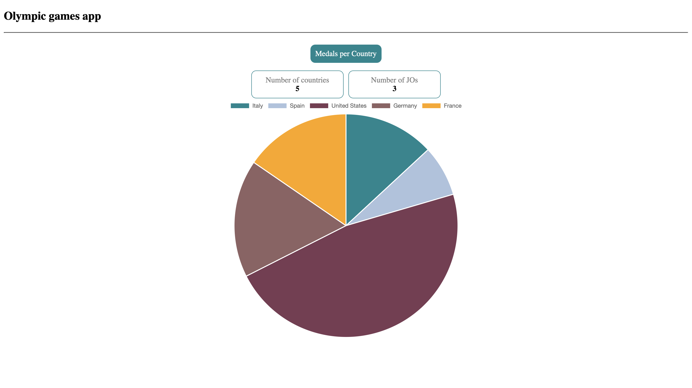
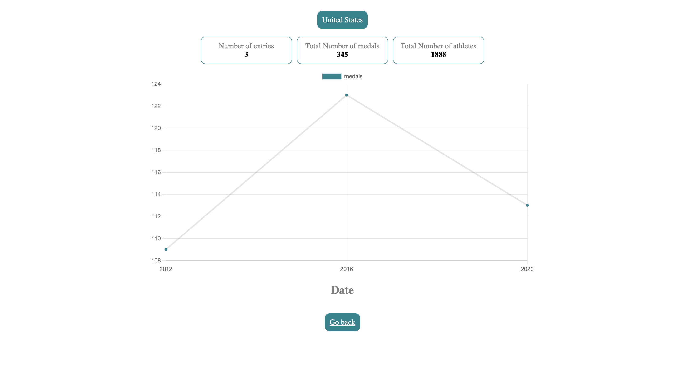
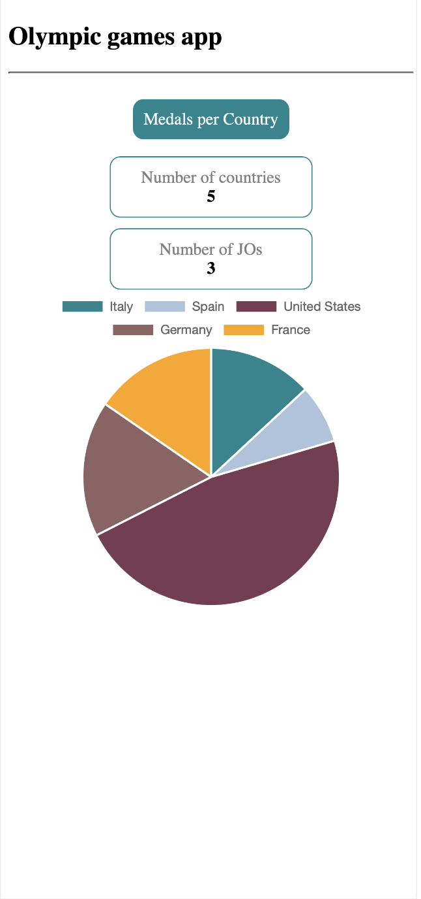
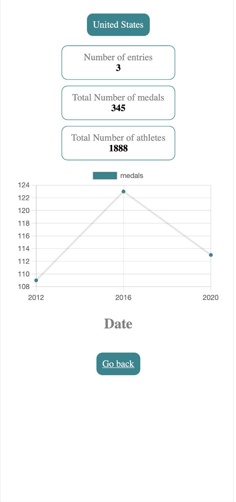

# OlympicGamesStarter

Application Angular de gestion et de visualisation des données des Jeux Olympiques.

Ce projet a été généré avec [Angular CLI](https://github.com/angular/angular-cli) version 18.0.6. Il sert de base pour développer une application complète de suivi des Jeux Olympiques.

## Sommaire

- [Installation](#installation)
- [Scripts de lancement](#scripts-de-lancement)
- [Structure du projet](#structure-du-projet)
- [Limites et axes d'amélioration](#limites-et-axes-damélioration)
- [Captures d'écran](#captures-décran)

## Installation

Assurez-vous d'avoir **Node.js** et **npm** installés sur votre machine.

1. Clonez le dépôt ou téléchargez le projet.
2. Installez les dépendances :

```bash
npm install
```

## Scripts de lancement

Lancez un serveur de développement local :

```bash
ng serve
```

Naviguez ensuite vers http://localhost:4200/.

## Structure du projet

L'architecture a été organisée pour séparer clairement la logique métier, les vues et les composants réutilisables :

```text
src/app/
    ├── components/       # Composants réutilisables
    ├── pages/            # Composants utilisés pour le routage
    ├── core/             # Logique métier
        ├── services/     # Services
        ├── models/       # Interfaces et types
```

`components` : Contient tous les composants réutilisables.

`pages` : Contient les composants associés aux routes de l'application.

`core` : Renferme la logique métier, notamment les services et les modèles de données.

## Limites et axes d'amélioration

### Limitations actuelles

Données statiques : L'application repose sur un fichier JSON local. Elle n'est pas connectée à une API externe dynamique, ce qui fige les données à la version du fichier inclus.

### Pistes d'évolution

Connexion API : Remplacer le service actuel par un appel à une API REST publique des Jeux Olympiques pour des données en temps réel.
Nouvelles fonctionnalités : Ajout d'un système de recherche, de filtres multi-critères (par année, sport, pays).

## Captures d'écran

UI de la homepage sur desktop



UI de la coutry page sur desktop



UI de la homepage sur mobile



UI de la country page sur mobile

