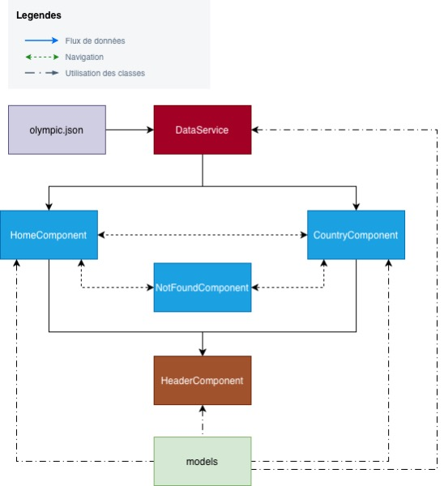

```text
Architecture et structure de l'application
    Les composants sont découpés par pages et non pas par éléments se trouvant dans celles-ci, comme demandé dans le cahier des charges. (cf. country.component.html, lignes 2 à 20)

    Les composants font des appels http alors qu'il est demandé d'utiliser un service (cf. country.component.ts, ligne 27)

    Il n'y a pas non plus les classes demandées (Olympic, Participation)


Qualité du code et Logique
    Utilisation du type any (cf. country.component.ts, ligne 30)

    Les composants font des calculs lourds et des conversions de types (cf. country.component.ts, lignes 35 à 38)

    Pas de gestion des états comme demandé dans le cahier des charges


Expérience utilisateur
    Il n'y a aucune gestion d'erreur dans le cas où un identifiant de pays n'est pas reconnu (message, redirection) (cf. country.component.ts, lignes 30-31)

    Pas d'adaptation aux différentes tailles d'écran spécifiées


Structure
    HTML redondant puisqu'il n'y a pas de component réutilisable comme demandé (cf. country.component.html, lignes 2 à 20)

    Fichiers SCSS vides et gestion du style de certains composants dans le SCSS global (cf. styles.scss)


Arborescence actuelle : 
src/app/pages
  ├── country/
  ├── home/
  ├── not-found/


Nouvelle arborescence :
src/app/
  ├── components/ # Composants réutilisables
      ├── header/
  ├── pages/ # Composants avec logique de routage
      ├── dashboard/
      ├── country-detail/
      ├── not-found/
  ├── services/ # Centralisation des appels data
  ├── models/ # Interfaces (Olympic, Participation)

```
